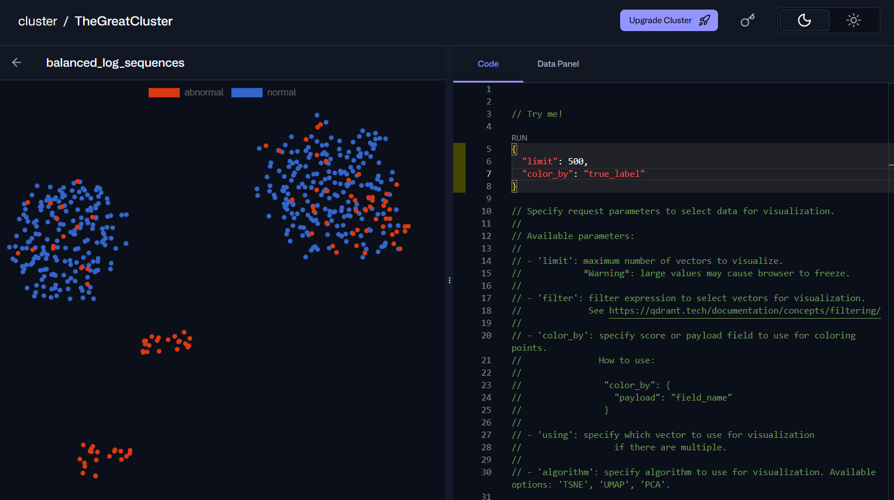

# HDFS Anomaly Detection

A streamlined pipeline for detecting anomalies in HDFS log data using OpenAI embeddings stored directly in Qdrant vector database.

Visualization of the stored Qdrant log embeddings:



## Quick Start

1. **Setup Environment**
   ```bash
   pip install -r requirements.txt
   ```

2. **Configure Environment Variables**
   Create `.env` file:
   ```
   OPENAI_API_KEY=your_openai_api_key
   QDRANT_URL=your_qdrant_cloud_url
   QDRANT_API_KEY=your_qdrant_api_key
   DETECTION_METHOD=distance  # or "dbscan"
   ```

3. **Run Pipeline**
   ```bash
   python main.py
   ```

## Individual Components

Run components separately if needed:

```bash
python ingest.py              # Download and balance HDFS data
python embed_and_ingest.py    # Create embeddings and upload to Qdrant
python detect_distance.py     # Distance-based anomaly detection
python detect_dbscan.py       # DBSCAN clustering detection
```

## Output Files

- `distance_detection_results.html` or `dbscan_detection_results.html` - Interactive visualizations
- `data/balanced_dataset.txt` - Balanced HDFS dataset (2000 samples, 80% normal)

## Detection Methods

- **Distance-based**: Uses k-NN distances with auto-tuned threshold
- **DBSCAN**: Uses density-based clustering with k-distance optimization

Both methods use t-SNE for 2D visualization and achieve ~40-50% precision with ~30-35% recall.
